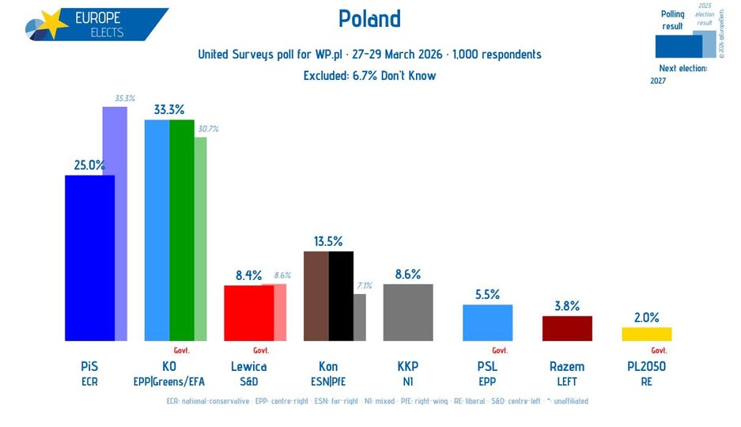

## Post detected at 2026-04-01 12:23:52 UTC

**Source:** [https://www.facebook.com/EuropeElects/posts/pfbid07spAy4C1yN6hbYo3MnwQufqDdz5E9vwREsVQLDNB6fnTYcBtJY81kmaifoeBHwfzl](https://www.facebook.com/EuropeElects/posts/pfbid07spAy4C1yN6hbYo3MnwQufqDdz5E9vwREsVQLDNB6fnTYcBtJY81kmaifoeBHwfzl)

**Post ID (hash):** `e7d486245eba5002`

### Text

Cuenta verificada
Compartido con: Público
Todas las reacciones:

### Image

*Original URL:* https://scontent.fscl15-1.fna.fbcdn.net/v/t39.30808-6/660810443_1550772223723528_967715528559608034_n.jpg?stp=dst-jpg_p180x540_tt6&_nc_cat=103&ccb=1-7&_nc_sid=13d280&_nc_ohc=XFX4DCez_ZoQ7kNvwHMeabo&_nc_oc=AdoDWqerwxbhF2u2keUQ9tJtGQyemIi4Mkhm-sjHDEVpuJm3jCt_W6jFyXrBZCpe7Es&_nc_zt=23&_nc_ht=scontent.fscl15-1.fna&_nc_gid=M1UKvmC38uYfn1ONgWazqQ&_nc_ss=7a389&oh=00_Af3gmw5cBBC4I66HVDWJlb3avrCYP1dulQIyGBQ9nnJB6Q&oe=69D2E0BD

---

## Post detected at 2026-04-01 12:33:59 UTC

**Source:** [https://www.facebook.com/EuropeElects/posts/pfbid07spAy4C1yN6hbYo3MnwQufqDdz5E9vwREsVQLDNB6fnTYcBtJY81kmaifoeBHwfzl](https://www.facebook.com/EuropeElects/posts/pfbid07spAy4C1yN6hbYo3MnwQufqDdz5E9vwREsVQLDNB6fnTYcBtJY81kmaifoeBHwfzl)

**Post ID (hash):** `bee30305c8b50aab`

### Text

Poland, United Surveys poll:
KO-EPP|G/EFA: 33%
PiS-ECR: 25%
Kon-ESN|PfE: 14% (-1)
KKP-NI: 9%
Lewica-S&D: 8% (+1)
PSL-EPP: 5% (+1)
Razem-LEFT: 4% (+2)
PL2050-RE: 2% (+1)
+/- vs. 13-15 March 2026
Fieldwork: 27-29 March 2026
Sample size: 1,000
➤
europeelects.eu/poland

### Image

*Original URL:* https://scontent-hou1-1.xx.fbcdn.net/v/t39.30808-6/660810443_1550772223723528_967715528559608034_n.jpg?stp=dst-jpg_p180x540_tt6&_nc_cat=103&ccb=1-7&_nc_sid=13d280&_nc_ohc=XFX4DCez_ZoQ7kNvwHSC22d&_nc_oc=AdrY5I86RHPErejhZtv2dQ1jfO6l_NwdszYpfVKJ-YW57AKKxw41edqCzPSlRSuopXY&_nc_zt=23&_nc_ht=scontent-hou1-1.xx&_nc_gid=NgRxo71bxEUwjItPDSruRw&_nc_ss=7a389&oh=00_Af36JcRwjETIUlJfegft1sIt2NLWH2xN4oyJlM0mbSrnjw&oe=69D2E0BD

---
